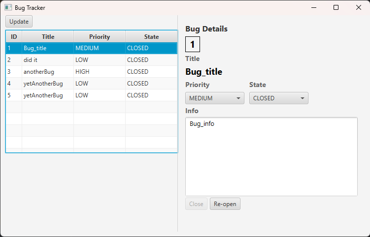
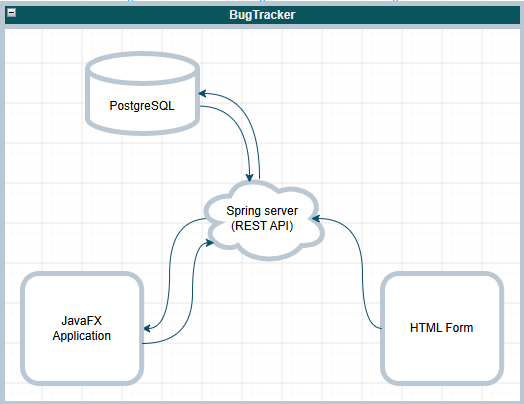

# BugTracker
___


**BugTracker** - Клиент-серверное приложение для трекинга багов. Проект написан на Java, с использованием Spring и JavaFX.
___

### Стек
- **Язык**: Java 21
- **Бекенд**: Spring Boot, Spring Data
- **Десктоп приложение**: JavaFX
- **СУБД**: PostgreSQL
- **Вспомогательные библиотеки**: Jackson, Lombok, SLF4J
- **Сборка**: Maven, многомодульный проект
___
### Схема работы приложения


### Структура проекта
Приложение является многомодульным Maven проектом для разделения логики и переиспользования кода, в частности - `shared/` модуль для общих у бекенда и фронта файлов.
```
bugtracker/
├── pom.xml                      # родительский pom
│
├── shared/                      # общий модуль
│   ├── pom.xml
│   └── src/main/java/edu.pet/   # BugResponse (DTO), enum'ы (State, Priority)
│
├── backend/                     # бекенд приложения (Spring Boot)
│   ├── pom.xml
│   └── src/main/
│       ├── java/.../
│       │   ├── configuration/   # надстройки сервера
│       │   ├── controller/      # REST-контроллеры
│       │   ├── entity/          # сущность JPA
│       │   ├── repository/      # JPA-репозиторий
│       │   ├── service/         # бизнес логина
│       │   └── utils/           # вспомогательные инструменты
│       └── resources/
│           ├── application.properties
│           └── secret.properties
│
└── frontend-app/                # десктоп-клиент (JavaFX)
    ├── pom.xml
    └── src/main/java/edu.pet/
        ├── logic/               # бизнес логика приложения
        ├── networking/          # методы для взаимодействия с сервером
        ├── view/                # классы UI приложения
        └── MainApplication.java # главный класс приложения
```
___

### Установка и запуск

**Требования**:
1. Java 21+
2. Maven
3. PostgreSQL


**1. Создать базу данных `bugtracker` и указать креды от нее в `secret.properties`**

**2. Склонировать репозиторий**:

```git clone https://github.com/reduct56/bugtracker.git```

**Backend**:
```bash
cd backend
mvn clean package
./target/backend-0.0.1-SNAPSHOT.jar
```

**Frontend**:
```bash
cd frontend_app
mvn clean package
./target/frontend_app-0.0.1-SNAPSHOT.jar
```

